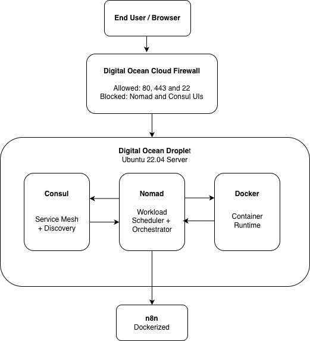

# PHASE 2: Infrastructure Provisioning and Setup

## 1. Introduction

This document describes the design and implementation of infrastructure used to automate the deployment of **n8n** using:

- DigitalOcean Droplet (Ubuntu Server)
- HashiCorp Nomad (Workload Orchestration)
- HashiCorp Consul (Service Discovery & Networking)
- Docker (Container Runtime)

The document combines conceptual architecture with practical deployment steps to provide a single, streamlined implementation reference.

## 2. Architecture Overview

### 2.1 Technology Stacks

| Component             | Purpose                                  |
|----------------------|-------------------------------------------|
| DigitalOcean Droplet | Cloud compute infrastructure              |
| Docker               | Container runtime for workloads           |
| Nomad                | Application scheduling and orchestration  |
| Consul               | Service discovery, health monitoring, and networking |

### 2.2 Deployment Model

This setup uses a **single-node cluster** where Nomad runs both:

- Server role (scheduling and cluster state)
- Client role (running workloads)

This configuration is recommended for:

- Development environments
- Lightweight production workloads
- Learning and proof-of-concept infrastructure


### 2.3 High-Level Architecture



*Fig: High Level Architecture Diagram*

## 3. Infrastructure Security Design

Security is enforced at multiple layers.

### 3.1 Network Security

- DigitalOcean Cloud Firewall restricts public traffic.
- Only web and SSH access are exposed publicly.
- Nomad and Consul dashboards remain private.

### 3.2 Host Security

- SSH key authentication only
- Disabled password-based login
- Non-root deployment user
- Service auto-start using systemd

## 4. Infrastructure Requirements

### 4.1 Droplet Specifications

| Resource | Recommended Value   |
|----------|--------------------|
| OS       | Ubuntu 22.04 LTS   |
| CPU      | 2 vCPU             |
| RAM      | 4 GB               |
| Storage  | 50 GB SSD          |

### 4.2 Required Network Ports

#### 4.2.1 Public Access

Following are the list of ports that should be allowed in DigitalOcean cloud firewall:

| Service | Port |
|---------|------|
| SSH     | 22   |
| HTTP    | 80   |
| HTTPS   | 443  |

#### 4.2.2 Internal Infrastructure Ports

| Component         | Port           |
|-------------------|----------------|
| Nomad API         | 4646           |
| Nomad RPC         | 4647           |
| Nomad Gossip      | 4648           |
| Consul HTTP API   | 8500           |
| Consul RPC        | 8300           |
| Consul Gossip     | 8301           |
| Consul DNS        | 8600           |
| Nomad Dynamic Ports | 20000-32000  |

*These ports should remain private.*

---

## 5. Infrastructure Deployment

### 5.1 Create DigitalOcean Droplet

1. Navigate to DigitalOcean Control Panel.
2. Select **Create → Droplet**
3. Choose **Ubuntu 22.04**.
4. Select **2 CPU / 4GB RAM** plan.
5. Upload SSH public key.
6. Deploy droplet.

### 5.2 Secure Server Access

Although DigitalOcean supports SSH key authentication during droplet creation, this implementation introduces an additional non-root deployment user. This follows the principle of least privilege and reduces security risk by preventing direct root login while maintaining administrative access through sudo escalation.

**Create non-root Deployment User:**

```sh
adduser admin
usermod -aG sudo admin
```

**Configure SSH Authentication:**

```sh
mkdir -p /home/admin/.ssh
nano /home/admin/.ssh/authorized_keys
```

**Set permissions:**

```sh
chmod 700 /home/admin/.ssh
chmod 600 /home/admin/.ssh/authorized_keys
chown -R admin:admin /home/admin/.ssh
```

**Disable Password Authentication:**

Edit:

```sh
sudo nano /etc/ssh/sshd_config
```

Set:

```sh
PasswordAuthentication no
PermitRootLogin no
```

Restart SSH:

```sh
sudo systemctl restart ssh
```

### 5.3 Configure DigitalOcean Firewall

Create firewall allowing:

| Protocol | Port | Source      |
|----------|------|-------------|
| TCP      | 22   | Trusted IP  |
| TCP      | 80   | Public      |
| TCP      | 443  | Public      |

Attach firewall to droplet.

### 5.4 Install Required Software

**Update System:**

```sh
sudo apt update && sudo apt upgrade -y
```

**Install Docker:**

```sh
curl -fsSL https://get.docker.com | sudo sh
sudo systemctl enable docker
sudo systemctl start docker
sudo usermod -aG docker admin
```

**Install Nomad:**

```sh
wget https://releases.hashicorp.com/nomad/1.7.3/nomad_1.7.3_linux_amd64.zip
sudo apt install unzip -y
unzip nomad_*.zip
sudo mv nomad /usr/local/bin/
```

**Install Consul:**

```sh
wget https://releases.hashicorp.com/consul/1.17.0/consul_1.17.0_linux_amd64.zip
unzip consul_*.zip
sudo mv consul /usr/local/bin/
```

### 5.5 Configure Consul

**Create Configuration:**

```sh
sudo mkdir -p /etc/consul.d
sudo mkdir -p /opt/consul
sudo nano /etc/consul.d/consul.hcl
```

**Sample Configuration:**

```hcl
datacenter = "dc1"
data_dir = "/opt/consul"
client_addr = "0.0.0.0"

server = true
bootstrap_expect = 1

bind_addr = "<private_node_ip>"
advertise_addr = "<private_node_ip>"

ui_config {
  enabled = true
}
```

### 5.6 Configure Nomad

**Create Directories:**

```sh
sudo mkdir -p /etc/nomad.d
sudo mkdir -p /opt/nomad
sudo nano /etc/nomad.d/nomad.hcl
```

**Sample Configuration:**

```hcl
datacenter = "dc1"
data_dir   = "/opt/nomad"
bind_addr  = "0.0.0.0"

server {
  enabled = true
  bootstrap_expect = 1
}

client {
  enabled = true
}

consul {
  address = "127.0.0.1:8500"
}
```

### 5.7 Configure Automatic Service Startup

Consul requires write access to its data directory. When running Consul as a dedicated service user, ownership of the data and configuration directories must be assigned accordingly to prevent startup failures.

**Create consul service user:**

```sh
sudo useradd --system --home /etc/consul.d --shell /bin/false consul
```

**Fix directory ownerships and permissions:**

```sh
sudo chown -R consul:consul /opt/consul
sudo chown -R consul:consul /etc/consul.d
sudo chmod 750 /opt/consul
sudo chmod 750 /etc/consul.d
```

**Create systemd file to start the consul service automatically:**

```ini
[Unit]
Description=Consul Service
After=network-online.target

[Service]
User=consul
Group=consul
ExecStart=/usr/local/bin/consul agent -config-dir=/etc/consul.d
Restart=on-failure

[Install]
WantedBy=multi-user.target
```

**Nomad systemd Service:**

```ini
[Unit]
Description=Nomad Service
After=consul.service

[Service]
ExecStart=/usr/local/bin/nomad agent -config=/etc/nomad.d
Restart=on-failure

[Install]
WantedBy=multi-user.target
```

**Enable Services:**

```sh
sudo systemctl daemon-reload
sudo systemctl enable consul
sudo systemctl enable nomad
sudo systemctl start consul
sudo systemctl start nomad
```

---

## 6. Verification Procedures

**Verify Consul Cluster:**

```sh
consul members
# Expected Result: server   alive
```

**Verify Nomad Node:**

```sh
nomad node status
# Expected Result: ready
```

**Verify Docker Runtime:**

```sh
docker ps
```

**Verify Service Status:**

```sh
sudo systemctl status consul
sudo systemctl status nomad
```

---

## 7. Secure Dashboard Access (Optional)

Access dashboards via SSH tunneling.

**Nomad UI:**

```sh
ssh -L 4646:localhost:4646 deploy@SERVER_IP
```

**Consul UI:**

```sh
ssh -L 8500:localhost:8500 deploy@SERVER_IP
```

---

## 8. Production Considerations

- Enable TLS encryption
- Enable Consul ACL policies
- Use multiple Nomad server nodes for HA
- Configure automated backups
- Implement monitoring and logging

---

## 9. Conclusion

This infrastructure provides a secure and scalable orchestration environment for automated deployment of n8n workflows. Nomad manages application lifecycle, Consul provides service networking, and Docker ensures portable runtime environments.